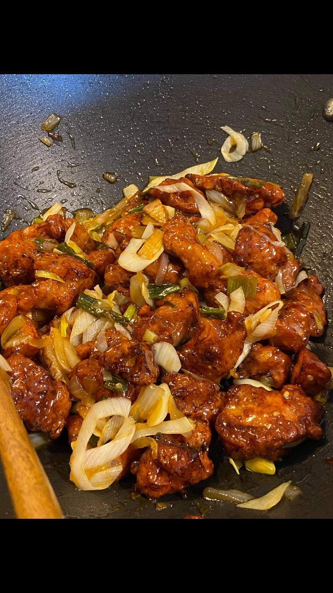

# Korean Spicy Garlic Fried Chicken Recipe 

line 2 changed remotely
This is one of my favourite chicken dishes to make. It's quick and easy while providing an exquisite flavours.  
Best served together with hot rice!  

**Required ingredients**
1. Chicken breast - 500g
2. Onion - 1 bulb
3. Salt
4. Pepper
5. Garlic
6. Oyster sauce
7. Dried red chillies
Other ingredients that you may need to customize your dish: challot, tumeric

Here is an image of the finished dish

### References
**Source: Billy Law's cookbook - Little Korea**

